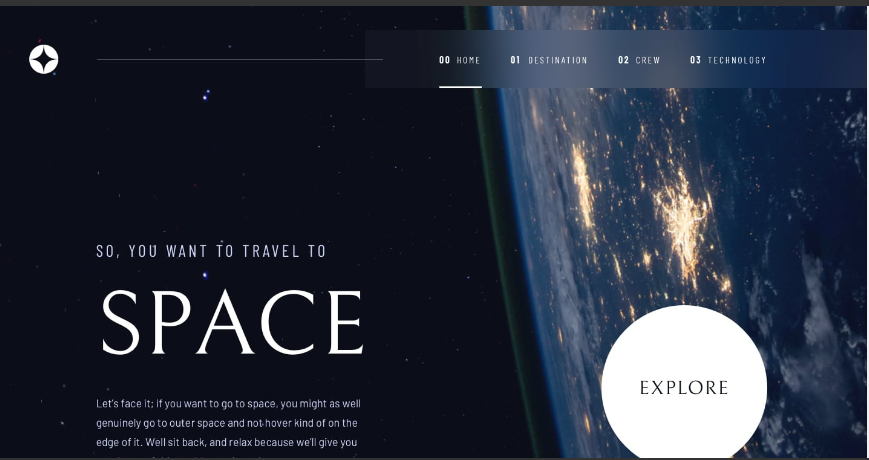

# SPACE TOUR WEBSITE

> This is a space touring website built with Vite, React, and Tailwind CSS, it's part of the intermediate challenges on frontend mentors



## Built With

- Vite

- React

  - JSX
  - React Router
  - Hooks
    - useEffect
    - useState
    - useLocation

- Tailwind

## Live Demo

[Live Demo Link](https://space-tourism-aaw.netlify.app/)

### Development (Running locally)

- Clone the project

```bash
git clone https://github.com/Lanr3waju/space-tour.git

```

- Install Dependencies

```bash
npm install
```

To automatically fix eslint issues found (where possible):

```bash
npm run lint
```

## 👤 Author

- Github: [@Lanr3waju](https://github.com/Lanr3waju>)
- LinkedIn: [@Abass Olanrewaju](https://www.linkedin.com/in/lanr3waju/)

## 🤝 Contributing

Contributions, issues and feature requests are welcome!

Feel free to check the [issues page](../../issues).

## Show your support

Give a ⭐️ if you like this project!

## Acknowledgments and Resources used

- [icon scout](https://iconscout.com/contributors/iqonic-design/)
- [Frontend Mentors](https://www.frontendmentor.io/challenges/space-tourism-multipage-website-gRWj1URZ3/hub)

## 📝 License

[MIT licensed](./LICENSE).
